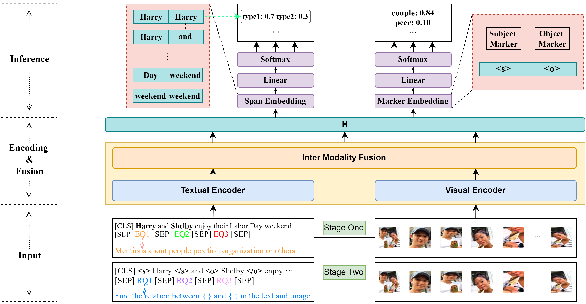

# MUMRC

Code for the ICME 2023 paper "A Unified MRC Framework with Multi-Query for Multi-modal Relation Triplets Extraction"

# Model Architecture

<div align=center>

</div>
 
 
 Illustration of MUMRC.


# Requirements


```
conda create -n mumrc python==3.7
conda activate mumrc
conda install pytorch==1.7.0 torchvision==0.8.0 torchaudio==0.7.0 cudatoolkit=11.0 -c pytorch
pip install transformers==4.18.0
```


# Data Download


The  dataset comes from [MEGA](https://github.com/thecharm/Mega) and [MKGformer](https://github.com/zjunlp/MKGformer), many thanks.


The expected structure of files is:


```
.
├── data
│   ├── img_detect
│   │   ├── test
│   │   ├── train
│   │   └── val
│   ├── img_org
│   │   ├── test
│   │   ├── train
│   │   └── val
│   ├── img_vg
│   │   ├── test
│   │   ├── train
│   │   └── val
│   ├── ours_rel2id.json
│   ├── txt
│   │   ├── mre_dev_dict.pth
│   │   ├── mre_test_dict.pth
│   │   ├── mre_train_dict.pth
│   │   ├── ours_test.txt
│   │   ├── ours_train.txt
│   │   └── ours_val.txt
│   ├── txt_merge
│   │   ├── dev.json
│   │   ├── ours_test.txt
│   │   ├── ours_val.txt
│   │   ├── test.json
│   │   └── train.json
│   └── vg_data
│       ├── mre_dev.pth
│       ├── mre_test.pth
│       └── mre_train.pth
├── MUMRC_BERT
│   ├── entity
│   │   ├── dataloader.py
│   │   ├── __init__.py
│   │   ├── models.py
│   │   └── utils.py
│   ├── output
│   │   └── 2024
│   ├── relation
│   │   ├── dataloader.py
│   │   ├── __init__.py
│   │   ├── models.py
│   │   └── utils.py
│   ├── run_entity.py
│   ├── run_relation.py
│   ├── shared
│   │   ├── ClipViT.py
│   │   ├── const.py
│   │   ├── data_structures.py
│   │   ├── loadimg.py
│   │   ├── myvisual.py
│   │   └── question_template.py
│   └── train.sh
├── MUMRC_RoBERTa
│   ├── entity
│   │   ├── dataloader.py
│   │   ├── models.py
│   │   └── utils.py
│   ├── output
│   │   └── 2024
│   ├── relation
│   │   ├── dataloader.py
│   │   ├── __init__.py
│   │   ├── models.py
│   │   └── utils.py
│   ├── run_entity.py
│   ├── run_relation.py
│   ├── shared
│   │   ├── ClipViT.py
│   │   ├── const.py
│   │   ├── data_structures.py
│   │   ├── loadimg.py
│   │   ├── myvisual.py
│   │   └── question_template.py
│   └── train.sh
└── requirements.txt
```

# How to run
  ```shell
  cd MUMRC_BERT
  bash train.sh
  ```

# Acknowledgement

The code is based on [PURE](https://github.com/princeton-nlp/PURE), many thanks.

# Papers for the Project & How to Cite
If you use or extend our work, please cite the paper as follows:

```bibtex
dwadwa dadwd
```
